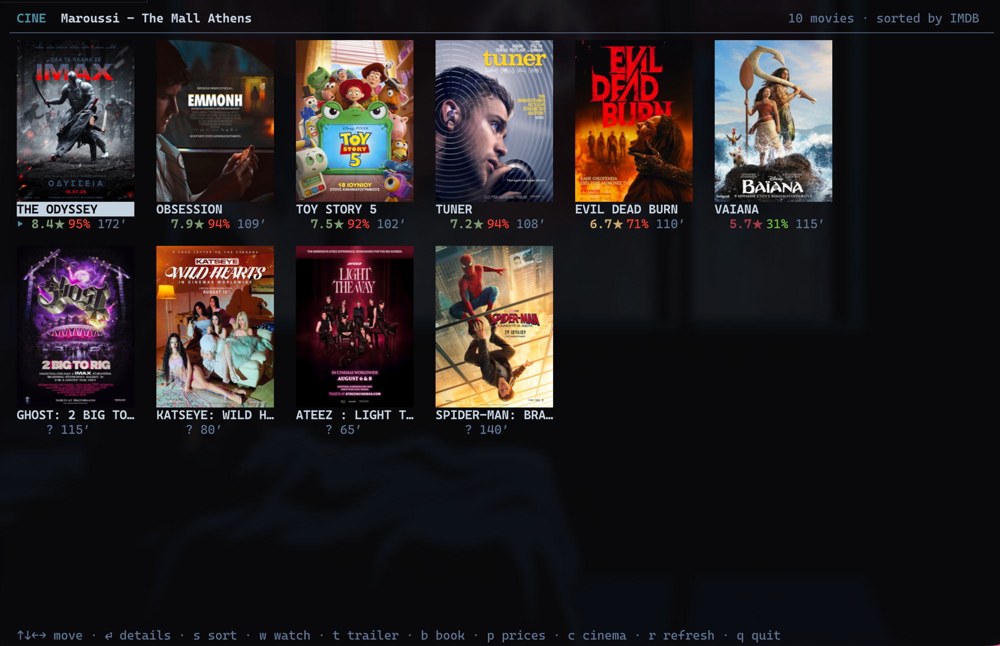
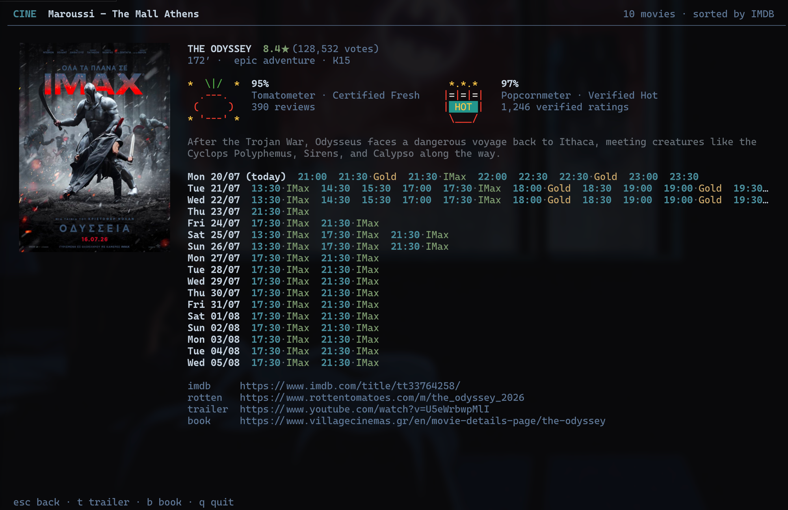
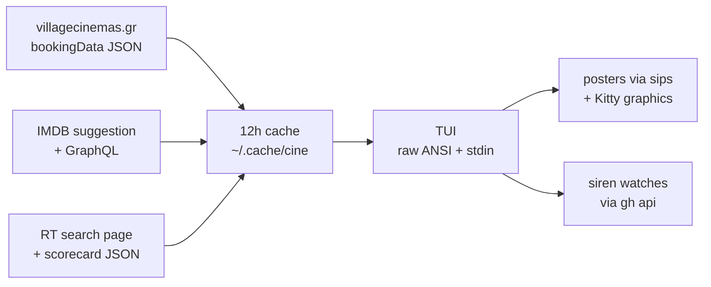

```
  ██████╗██╗███╗   ██╗███████╗
 ██╔════╝██║████╗  ██║██╔════╝
 ██║     ██║██╔██╗ ██║█████╗
 ██║     ██║██║╚██╗██║██╔══╝
 ╚██████╗██║██║ ╚████║███████╗
  ╚═════╝╚═╝╚═╝  ╚═══╝╚══════╝
```

<div align="center">

### `EVERY MOVIE IN ATHENS // SORTED BY WHETHER IT'S ANY GOOD`

*a full-screen poster wall for Village Cinemas Greece — showtimes, IMDB and Rotten Tomatoes verdicts, in the terminal*

   -FBBF24?style=flat-square&labelColor=111111) 

</div>

---

## 🎬 What is this

`cine` answers the only two questions that matter on a Friday night: what's playing at your Village cinema, and is it actually worth 12 euros. It scrapes villagecinemas.gr's booking data, cross-references every movie against IMDB and Rotten Tomatoes (no API keys — just public endpoints and good manners), and lays it all out as a wall of real movie posters rendered natively in your terminal via the Kitty graphics protocol.

Arrow around the grid, hit enter, and you get the full case file: the poster up close, both Tomatometer and Popcornmeter with text-character recreations of RT's actual icons (the certified-fresh tomato, the spilled popcorn bucket — all of them), plot, and every showtime for the next three weeks. It remembers your cinema, caches for 12 hours, and falls back to a plain list when piped — because sometimes you just want `cine | grep IMAX`.

It started as a TypeScript port of [village_crawler](https://github.com/johneliades/village_crawler) and ended up with opinions.

```console
nick@cine:~$ cine
[✓] the mall athens: 10 movies, sorted by imdb. the odyssey opens at 8.4.
[i] vaiana is 31% on the tomatometer. the audience gave it 89. someone is wrong.
```

## 🍿 The wall

| | feature | what it actually does |
|---|---|---|
| 01 | **poster grid** | what it actually is — every upcoming movie as its theatrical poster, sorted by rating, drawn pixel-for-pixel in the terminal (half-block mosaic on non-Kitty terminals) |
| 02 | **triple verdict** | what it actually pulls — IMDB rating via suggestion API + GraphQL, Tomatometer and Popcornmeter scraped from RT's embedded scorecard JSON, localized titles resolved through IMDB's canonical name (VAIANA → Moana) |
| 03 | **rt icons in ascii** | what it actually renders — certified fresh, fresh tomato, rotten splat, verified hot, upright and spilled popcorn buckets, each exactly 9 columns of colored text characters |
| 04 | **sort toggle** | what it actually cycles — IMDB → Tomatometer → Popcornmeter → runtime, one keypress, persisted between runs |
| 05 | **ticket alerts** | what it actually edits — the watch list of [siren](https://github.com/nitrimandylis/siren) via `gh api`, so a GitHub Action pings your phone when booking opens (workflow untouched, forever) |
| 06 | **smart cache** | what it actually avoids — refetching for 12 hours, invalidating itself when the schema changes or every cached showtime is in the past |
| 07 | **availability colors** | what it actually mirrors — village's own soldout/limited flags (cyan, yellow, red ✗) — which lag reality, because the live seat map hides behind a captcha we don't fight |

**Keys:** `↑↓←→` move · `⏎` details · `s` sort · `w` watch · `t` trailer · `b` book · `p` prices · `c` cinema · `r` refresh · `q` quit

## 📸 Evidence


*the wall — ten movies, ten posters, one obvious winner*


*the odyssey's case file — certified fresh tomato and hot popcorn bucket, in text characters, as nature intended*

## 🚀 Run it

You need [bun](https://bun.sh) and macOS (posters lean on `sips`, links on `open`).

```bash
git clone https://github.com/nitrimandylis/cine.git
cd cine
bun run compile   # → ~/.bun/bin/cine, man page into your manpath
cine
man cine          # the full reference, offline
```

First run asks which cinema you go to. It never asks again.

## 🔩 Under the hood



| layer | path | job |
|---|---|---|
| everything | `cine.ts` | scraper, enrichment, cache, poster pipeline, hand-rolled TUI — one file, compiled to one binary |
| tests | `cine.test.ts` | pure-logic checks: parsers, cache staleness, icon alignment, sort order |
| man page | `man/cine.1` | hand-written roff, installed by `bun run compile` |

**Stack:** bun · typescript · fetch · sips(1) · open(1) · gh(1) — and zero packages in node_modules that aren't `@types/bun`

---

<div align="center">

**[Nick Trimandylis](https://github.com/nitrimandylis)**

`SCRAPED POLITELY. RENDERED LOCALLY. BOOKED EARLY`

Built on the shoulders of [johneliades/village_crawler](https://github.com/johneliades/village_crawler),
which reverse-engineered the Village booking data first — cine is its TypeScript descendant.

MIT licensed.

</div>
