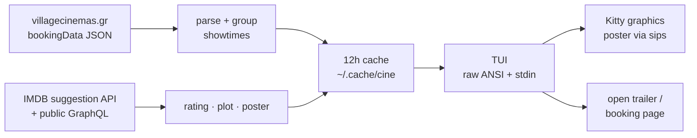

<h1 align="center">🎬 cine</h1>

<p align="center">
  Village Cinemas (Greece) showtimes in your terminal — IMDB ratings, real posters, zero dependencies.
</p>

<p align="center">
  
  
  
  
</p>

`cine` shows what's playing at your Village cinema, sorted by IMDB rating, in a
full-screen TUI. Arrow through movies and days, hit ⏎ for the detail view —
plot, all showtimes, and the actual movie poster rendered in your terminal
(Kitty graphics protocol in Ghostty/kitty/WezTerm, half-block mosaic anywhere
else). It remembers your cinema, caches for 12 hours, and opens trailers and
booking pages straight in the browser.

A TypeScript rewrite of [village_crawler](https://github.com/johneliades/village_crawler),
reshaped into an interactive TUI.

## Run it

```bash
git clone https://github.com/nitrimandylis/cine.git
cd cine
bun run compile   # → ~/.bun/bin/cine, and man cine into your manpath
cine
man cine          # full reference, offline
```

## Keys

| Key | Action |
|-----|--------|
| `↑` `↓` | move between movies |
| `←` `→` | change day |
| `⏎` | detail view — poster, plot, every showtime |
| `t` | open trailer in browser |
| `b` | open booking page |
| `p` | ticket price table |
| `c` | switch cinema (becomes the new default) |
| `r` | refresh (skip cache) |
| `q` / `esc` | quit / back |

Flags for scripting: `-c <id>`, `-d DD/MM`, `--list`, `--clear`, `--no-cache`.
Piped output (`cine -c 21 | cat`) prints a plain list instead of the TUI.

## Under the hood



No npm packages at runtime — `fetch` for the network, `sips(1)` for image
conversion, `open(1)` for the browser, hand-rolled ANSI for the TUI.

## License

MIT
