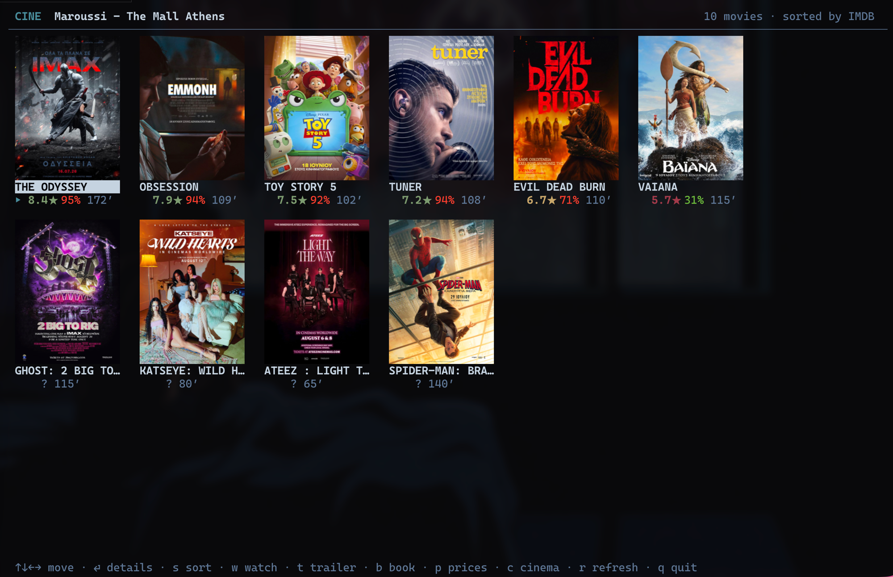
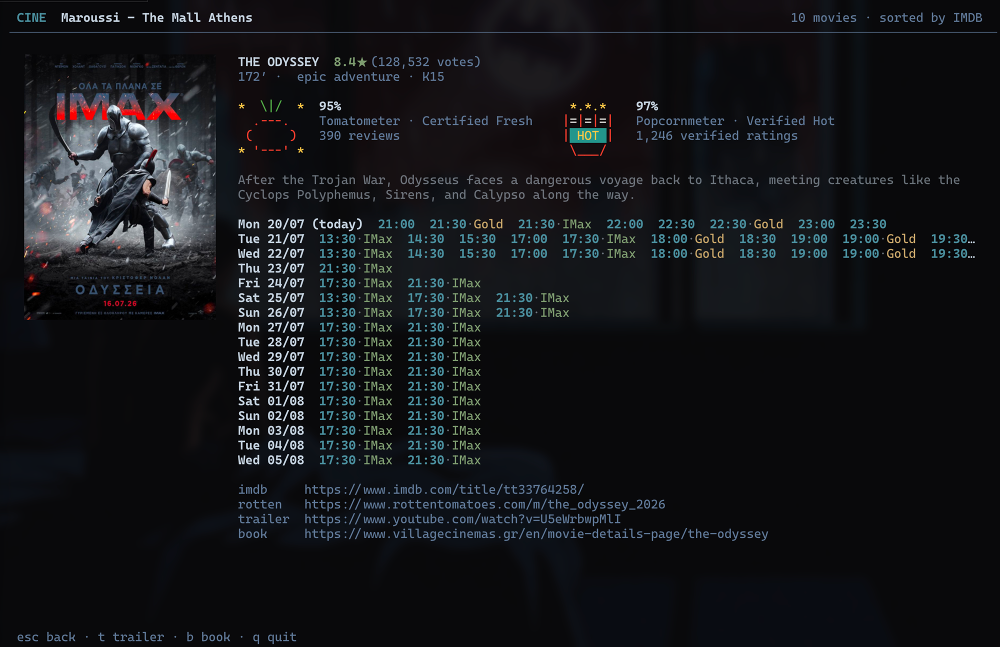
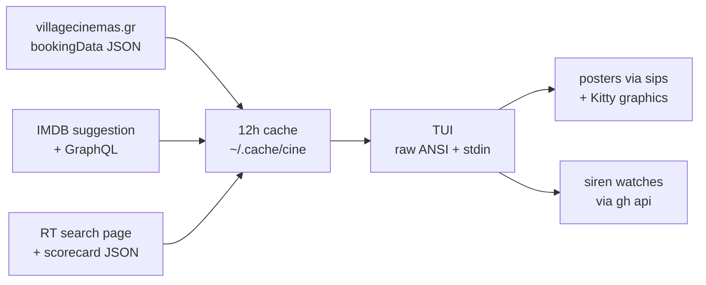
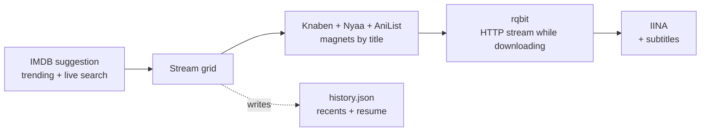

```
  ██████╗██╗███╗   ██╗███████╗
 ██╔════╝██║████╗  ██║██╔════╝
 ██║     ██║██╔██╗ ██║█████╗
 ██║     ██║██║╚██╗██║██╔══╝
 ╚██████╗██║██║ ╚████║███████╗
  ╚═════╝╚═╝╚═╝  ╚═══╝╚══════╝
```

<div align="center">

### `EVERY MOVIE IN ATHENS // SORTED BY WHETHER IT'S ANY GOOD`

*a full-screen poster wall for Village Cinemas Greece — showtimes, IMDB and Rotten Tomatoes verdicts, in the terminal*
*· and a second tab that streams anything else straight into IINA ·*

   -FBBF24?style=flat-square&labelColor=111111) 

</div>

---

## 🎬 What is this

`cine` answers the only two questions that matter on a Friday night: what's playing at your Village cinema, and is it actually worth 12 euros. It scrapes villagecinemas.gr's booking data, cross-references every movie against IMDB and Rotten Tomatoes (no API keys — just public endpoints and good manners), and lays it all out as a wall of real movie posters rendered natively in your terminal via the Kitty graphics protocol.

Arrow around the grid, hit enter, and you get the full case file: the poster up close, both Tomatometer and Popcornmeter with text-character recreations of RT's actual icons (the certified-fresh tomato, the spilled popcorn bucket — all of them), plot, and every showtime for the next three weeks. It remembers your cinema, caches for 12 hours, and falls back to a plain list when piped — because sometimes you just want `cine | grep IMAX`.

And then there's the other tab. Hit `⇥` and cine flips from **Village** to **Stream** — a streaming hub for everything that *isn't* playing near you. Search any title, pick a source, and it plays in IINA. No streaming-site scrapers (those rot weekly, on a key-rotation treadmill); cine resolves a magnet, streams it through `rqbit` while it's still downloading, and hands the URL to your player. A magnet is a content hash, so there's nothing to keep patching.

It started as a TypeScript port of [village_crawler](https://github.com/johneliades/village_crawler) and ended up with opinions.

```console
nick@cine:~$ cine
[✓] the mall athens: 10 movies, sorted by imdb. the odyssey opens at 8.4.
[i] vaiana is 31% on the tomatometer. the audience gave it 89. someone is wrong.
```

## 🍿 The wall

| | feature | what it actually does |
|---|---|---|
| 01 | **poster grid** | what it actually is — every upcoming movie as its theatrical poster, sorted by rating, drawn pixel-for-pixel in the terminal (half-block mosaic on non-Kitty terminals) |
| 02 | **triple verdict** | what it actually pulls — IMDB rating via suggestion API + GraphQL, Tomatometer and Popcornmeter scraped from RT's embedded scorecard JSON, localized titles resolved through IMDB's canonical name (VAIANA → Moana) |
| 03 | **rt icons in ascii** | what it actually renders — certified fresh, fresh tomato, rotten splat, verified hot, upright and spilled popcorn buckets, each exactly 9 columns of colored text characters |
| 04 | **sort toggle** | what it actually cycles — IMDB → Tomatometer → Popcornmeter → runtime, one keypress, persisted between runs |
| 05 | **ticket alerts** | what it actually edits — the watch list of [siren](https://github.com/nitrimandylis/siren) via `gh api`, so a GitHub Action pings your phone when booking opens (workflow untouched, forever); each watch is pinned to one cinema, so the same film at Pagrati and The Mall are two separate alerts |
| 06 | **smart cache** | what it actually avoids — refetching for 12 hours, invalidating itself when the schema changes or every cached showtime is in the past |
| 07 | **availability colors** | what it actually mirrors — village's own soldout/limited flags (cyan, yellow, red ✗) — which lag reality, because the live seat map hides behind a captcha we don't fight |

**Village keys:** `↑↓←→` move · `⏎` details · `s` sort · `w` watch · `t` trailer · `b` book · `p` prices · `c` cinema · `r` refresh · `⇥` tab · `q` quit

## 📺 The other tab

Press `⇥` for **Stream** and cine stops caring about Athens. Type a title, hit play, watch it in IINA — sourced from torrent indexers, streamed through [`rqbit`](https://github.com/ikatson/rqbit) as it downloads.

| | feature | what it actually does |
|---|---|---|
| 01 | **a landing, not a blank box** | opens on your recently-played titles above IMDB's trending movies and TV — one scrolling wall, labeled `── … ──` dividers |
| 02 | **live search** | `/` and type; results stream in as you go (IMDB suggestion API, debounced) — no enter-to-search |
| 03 | **source picker** | seeders, size, and a **quality** column parsed out of the release name (2160p · HDR · x265 · WEB-DL), highest-seeded first, across Knaben (movies/TV) + Nyaa (anime — anime-only, so no anime bleeds into a TV search) — filtered to the show you actually asked for, so `House` returns *House*, not `House of the Dragon` |
| 04 | **buffering feedback** | after you pick, cine buffers the file head (showing MB · speed) before handing the URL to IINA — so playback starts instead of hanging on an empty stream |
| 05 | **tv & anime browser** | series open a season/episode browser (IMDB GraphQL); anime is detected via AniList and numbered the way Nyaa releases it — romaji + episode, not `SxxEyy`. Each episode is searched under every AniList title (romaji · english · synonyms, so `DAN DA DAN` is found, not just `Dandadan`), padded and unpadded; still-airing shows work; `--dub` prefers dual-audio |
| 06 | **watched & resume** | `✓` on episodes you've streamed, selection jumps to the next unwatched one, `n` plays the next episode without reopening the picker |
| 07 | **subtitles, handled** | external English `.srt` by IMDB id (yifysubtitles), plus any subs shipped in the torrent, plus embedded MKV tracks — all attached to IINA, English first |

**Stream keys:** `⇥` tab · `/` search · `↑↓←→` move · `⏎` details · `p` play · `n` next episode · `q` quit

**Skip the TUI entirely.** `cine stream <title>` runs the same pipeline from the command line — [`fzf`](https://github.com/junegunn/fzf) picks the title, then the source, and it plays in IINA. Pick a **series** and it steps through season → episode first (`SxxEyy` for TV, romaji + number for anime, same as the tab); a season-pack source adds one more `fzf` to choose the file. The [lobster](https://github.com/justchokingaround/lobster) flow, torrent-native.

```console
nick@cine:~$ cine stream dune
  title>  Dune: Part Two (2024)  ·  movie
  source>  1243▲   3.1 GiB  2160p HDR      knaben   Dune.Part.Two.2024.2160p...
▸ buffering 8.2 MB · 4.1 MB/s → IINA

nick@cine:~$ cine stream severance
  title>   Severance (2022)  ·  TV
  season>  Season 2
  episode> S02E07  Chikhai Bardo · 9.1
  source>  312▲   2.4 GiB  1080p WEB-DL    knaben   Severance.S02E07.1080p...

nick@cine:~$ cine stream dandadan --dub
  title>    DAN DA DAN (2024)  ·  TV
  episode>    3
  source>   75▲   1.4 GiB  1080p WEB-DL    nyaa     [Group] DAN DA DAN - 03 (Dual Audio)...
```

> Streaming needs [`rqbit`](https://github.com/ikatson/rqbit) (`brew install rqbit`) and [IINA](https://iina.io); the `stream` command also needs [`fzf`](https://github.com/junegunn/fzf) (`brew install fzf`). Village works without any of them.

## 📸 Evidence


*the wall — ten movies, ten posters, one obvious winner*


*the odyssey's case file — certified fresh tomato and hot popcorn bucket, in text characters, as Nolan intended*

## 🚀 Run it

You need [bun](https://bun.sh) and macOS (posters lean on `sips`, links on `open`).

```bash
git clone https://github.com/nitrimandylis/cine.git
cd cine
bun run compile   # → ~/.bun/bin/cine, man cine, and the agent skill
cine
man cine          # the full reference, offline
```

First run asks which cinema you go to. It never asks again. For the Stream tab, `brew install rqbit` and grab [IINA](https://iina.io) — the Village tab needs neither.

## 🤖 The agent skill

`cine-cli/SKILL.md` is an agent skill for driving `cine` — that piping gives a plain list instead of the TUI, that the availability colours are Village's own flags rather than the live seat map, and that `cine stream` needs a human at the picker. The traps that don't fit in `--help`, in other words. `bun run compile` copies it into `~/.claude/skills/` if you already have that directory, and leaves your machine alone if you don't.

It's a plain directory at the repo root rather than a `.claude/` one, because this repo is public and not everyone drives it with the same agent. Point yours at the file.

## 🔩 Under the hood


```mermaid
flowchart LR
    A[villagecinemas.gr<br/>bookingData JSON] --> D[12h cache<br/>~/.cache/cine]
    B[IMDB suggestion<br/>+ GraphQL] --> D
    C[RT search page<br/>+ scorecard JSON] --> D
    D --> E[TUI<br/>raw ANSI + stdin]
    E --> F[posters via sips<br/>+ Kitty graphics]
    E --> G[siren watches<br/>via gh api]
```

...and the Stream tab, which never touches villagecinemas.gr at all:


```mermaid
flowchart LR
    S[IMDB suggestion<br/>trending + live search] --> H[Stream grid]
    H --> K[Knaben + Nyaa + AniList<br/>magnets by title]
    K --> R[rqbit<br/>HTTP stream while downloading]
    R --> I[IINA<br/>+ subtitles]
    H -. writes .-> J[history.json<br/>recents + resume]
```

| layer | path | job |
|---|---|---|
| everything | `cine.ts` | scraper, enrichment, cache, poster pipeline, hand-rolled TUI — one file, compiled to one binary |
| tests | `cine.test.ts` | pure-logic checks: parsers, cache staleness, icon alignment, sort order |
| man page | `man/cine.1` | hand-written roff, installed by `bun run compile` |

**Stack:** bun · typescript · fetch · sips(1) · open(1) · gh(1) · rqbit(1) · iina(1) — and zero packages in node_modules that aren't `@types/bun`

---

<div align="center">

**[Nick Trimandylis](https://github.com/nitrimandylis)**

`SCRAPED POLITELY. RENDERED LOCALLY. BOOKED EARLY`

Built on the shoulders of [johneliades/village_crawler](https://github.com/johneliades/village_crawler),
which reverse-engineered the Village booking data first — cine is its TypeScript descendant.

The Stream tab owes its shape to two terminal players: [lobster](https://github.com/justchokingaround/lobster)
for the fzf search → source-picker → hand-off-to-a-player flow, and
[ani-cli](https://github.com/pystardust/ani-cli) for how to think about anime — title
variants, episode numbering, and the sub/dub split (cine stays torrent-native, so it
borrows the ideas, not the streaming-site extraction).

MIT licensed.

</div>
